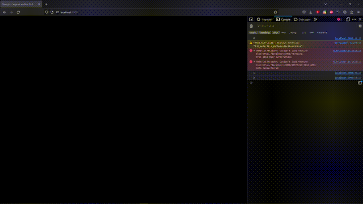

# GLB Animation Manage Through Scroll Input

This repository provides a simple way to manage GLB animations using scroll input. By scrolling up or down, you can control the playback of the animation in both forward and backward directions.

## Installation

To get started, follow these steps:

1. Install [Node.js](https://nodejs.org) if you haven't already.
2. Clone this repository to your local machine or download the source code as a ZIP file.
3. Open a terminal or command prompt and navigate to the project directory.
4. Run the following command to install the required dependencies:

## node server.js

1. Open a web browser and visit `http://localhost:3000`.
2. Scroll up or down on the page to control the animation playback. Scrolling up will play the animation forward, while scrolling down will play it backward.

